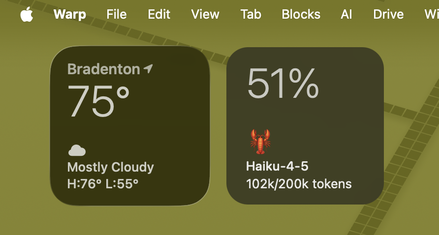

# TokenTicker 🦞



## Why TokenTicker?

If tokens are the new currency, then we want to monitor them. Upcoming versions will include a stock watchlist-style interface where users can monitor several API keys or token balances at once. Think percentages with directional indicators showing funds rising or falling in real time.

---

## What It Does

Monitor your AI agent's token usage at a glance. Install it on the machine where OpenClaw runs.

Reads from `openclaw sessions status` every 60 seconds. No API keys needed — it uses your existing setup.

---

## Install

```bash
git clone https://github.com/LizMyers/token-ticker.git
cd token-ticker
swift build -c release
cp .build/release/TokenTicker /Applications/
```

Launch with Spotlight: **Cmd+Space** → `TokenTicker`<br>
**IMPORTANT** — be sure to select the executable and NOT the folder

**Requires:** macOS 13+ and [OpenClaw](https://openclaw.ai)

---

## Make It Your Own

All visual tweaks live in `ContentView.swift`:

**Font size & weight:**
```swift
.font(.system(size: 42, weight: .light))  // percentage display
.font(.system(size: 13, weight: .medium)) // labels
```

**Spacing:**
```swift
.padding(.top, 23)
.padding(.bottom, 26)
.padding(.leading, 20)
```

**Widget size:**
```swift
.frame(width: 160, height: 160)
```

**Refresh interval** (in `TokenDataProvider.swift`):
```swift
Timer.scheduledTimer(withTimeInterval: 60, repeats: true)  // seconds
```

---

## License

MIT — Liz Myers
