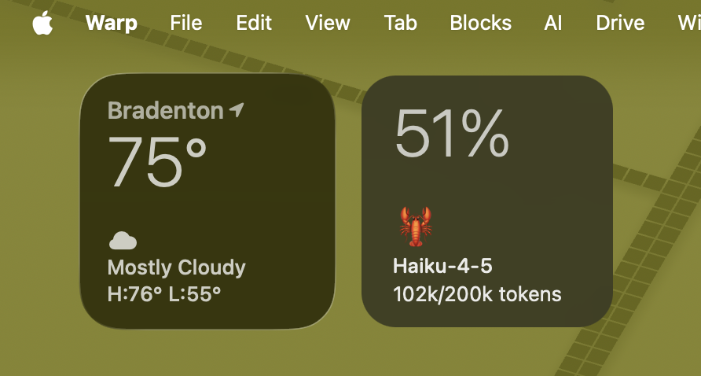

# TokenTicker for Your Moltbot 🦞




## Why TokenTicker?

Tokens are the new currency and it's handy to monitor them - just like a stock ticker! Speaking of which, future versions will offer an extended list view where you can monitor several API keys at once. Think percentages with directional indicators showing token balances rising or falling in real time. Watch this space.

## Features

- **Glanceable** — Large percentage, always visible on your desktop
- **Auto-refresh** — Polls every 60 seconds
- **Zero config** — Reads your existing OpenClaw session, no API keys to enter
- **Lightweight** — Native Swift, minimal footprint

## Install

```bash
git clone https://github.com/LizMyers/token-ticker.git
cd token-ticker
swift build -c release
cp .build/release/TokenTicker /Applications/
```

Launch with Spotlight: **Cmd+Space** → `TokenTicker`<br>
**IMPORTANT** — select the executable, not the folder

**Requires:** macOS 13+ and [OpenClaw](https://openclaw.ai)

## How It Works

```
TokenTicker          OpenClaw
┌──────────┐        ┌──────────────────┐
│  Widget  │──poll──│ sessions status  │
│  (60s)   │◀─usage─│ 168k/200k (84%)  │
└──────────┘        └──────────────────┘
```

Reads from `openclaw sessions status`. That's it.

## Start on Login

Want Token Ticker waiting for you every morning? Add a LaunchAgent:

```bash
# Create the plist (update the path to match your setup)
cat > ~/Library/LaunchAgents/com.liz.token-ticker.plist << 'EOF'
<?xml version="1.0" encoding="UTF-8"?>
<!DOCTYPE plist PUBLIC "-//Apple//DTD PLIST 1.0//EN" "http://www.apple.com/DTDs/PropertyList-1.0.dtd">
<plist version="1.0">
<dict>
    <key>Label</key>
    <string>com.liz.token-ticker</string>
    <key>ProgramArguments</key>
    <array>
        <string>/YOUR/PATH/TO/token-ticker/.build/release/TokenTicker</string>
    </array>
    <key>RunAtLoad</key>
    <true/>
    <key>KeepAlive</key>
    <false/>
    <key>EnvironmentVariables</key>
    <dict>
        <key>PATH</key>
        <string>/opt/homebrew/bin:/usr/local/bin:/usr/bin:/bin:/usr/sbin:/sbin</string>
    </dict>
</dict>
</plist>
EOF

# Enable it
launchctl load ~/Library/LaunchAgents/com.liz.token-ticker.plist
```

**Note:** The `EnvironmentVariables` section ensures Token Ticker can find `openclaw` when launching at login. Without it, the widget will appear empty.

To disable auto-launch later:

```bash
launchctl unload ~/Library/LaunchAgents/com.liz.token-ticker.plist
```

To re-enable, run the `load` command again. Token Ticker remembers its window position between restarts.

## Make It Your Own

All visual tweaks live in `ContentView.swift`:

**Font size & weight:**
```swift
.font(.system(size: 42, weight: .light))  // percentage display
.font(.system(size: 13, weight: .medium)) // labels
```

**Spacing:**
```swift
.padding(.top, 23)
.padding(.bottom, 26)
.padding(.leading, 20)
```

**Widget size:**
```swift
.frame(width: 160, height: 160)
```

**Refresh interval** (in `TokenDataProvider.swift`):
```swift
Timer.scheduledTimer(withTimeInterval: 60, repeats: true)  // seconds
```

## Changelog

### v1.1
- **Dynamic model name** — The widget now reads the active model from `openclaw sessions` instead of displaying a hardcoded name. Supports Claude, GPT, and other model naming conventions.

### v1.0
- Initial release — floating desktop widget with token usage percentage, trend lobster, and auto-refresh.

## Credits

Built by [Liz Myers](https://github.com/LizMyers) & [Claude](https://claude.ai), for the [OpenClaw](https://openclaw.ai/) community.


## License

MIT
